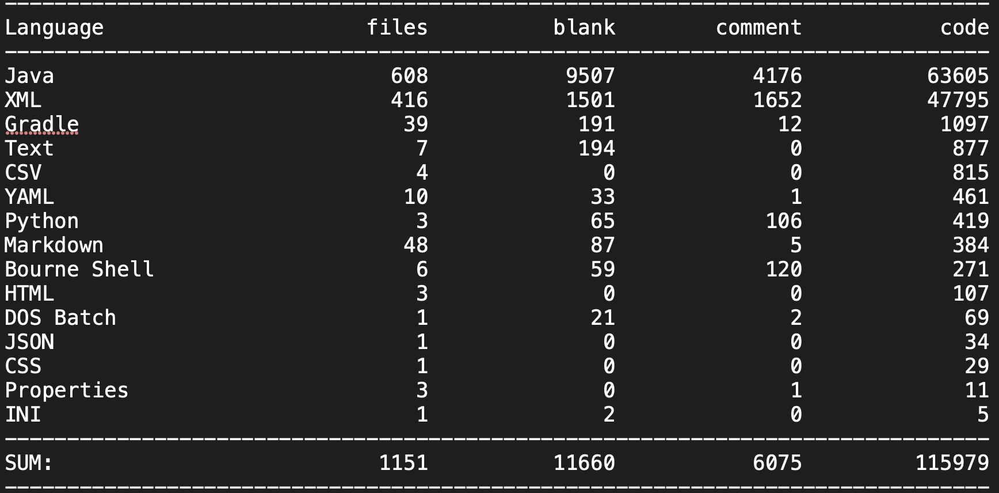
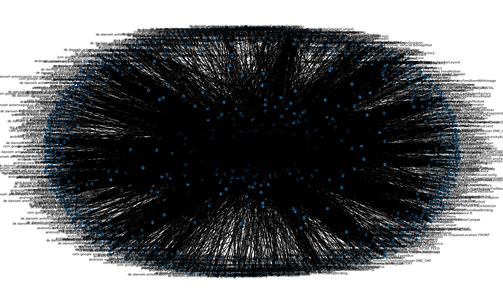
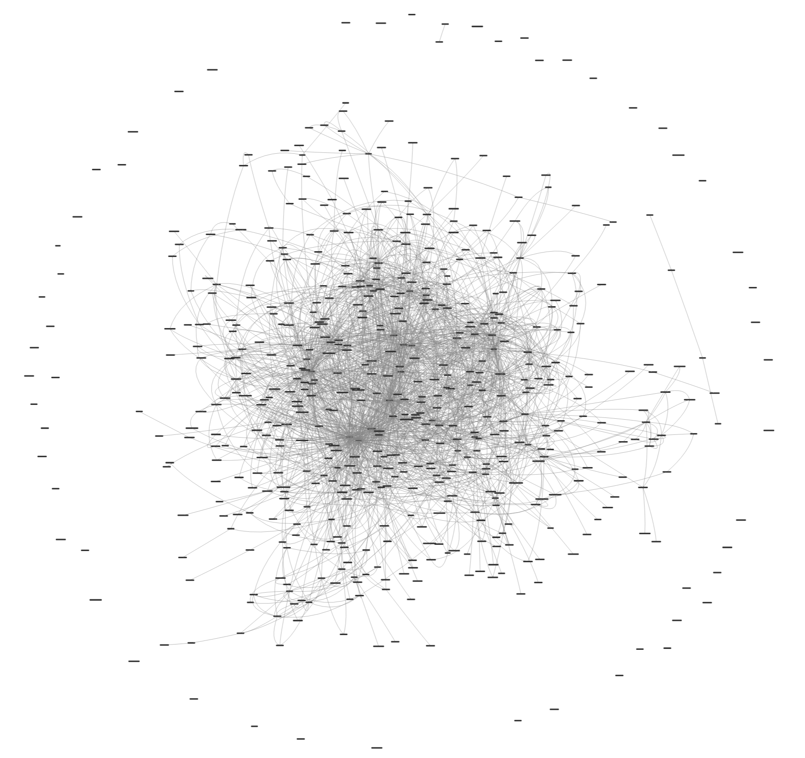
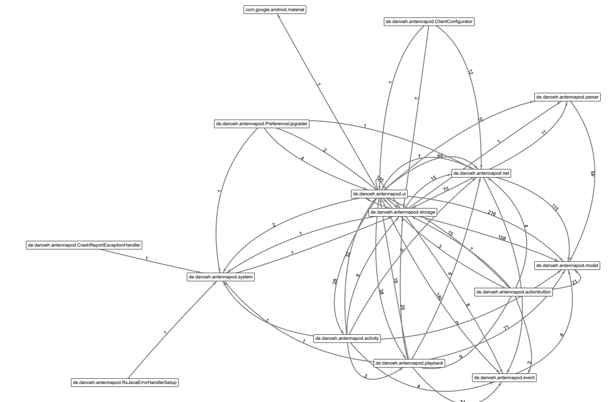
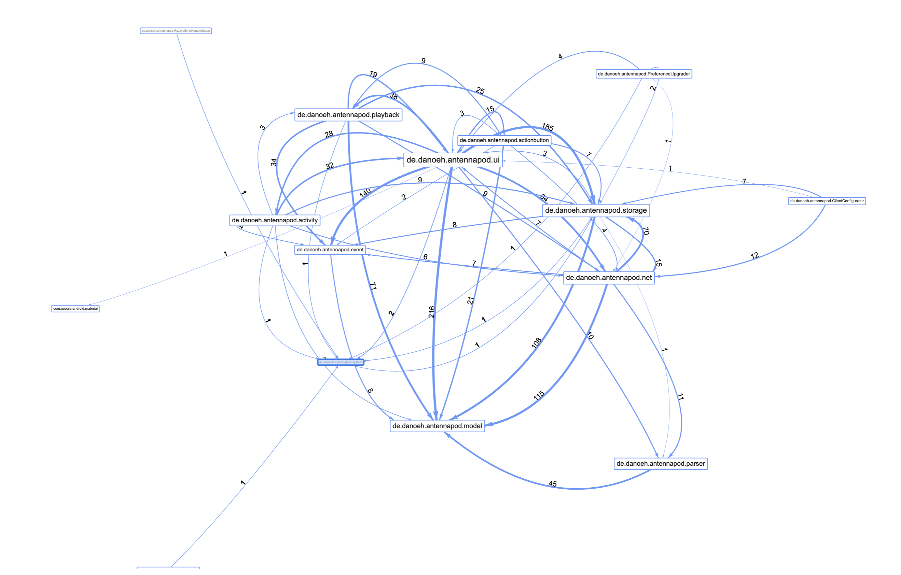
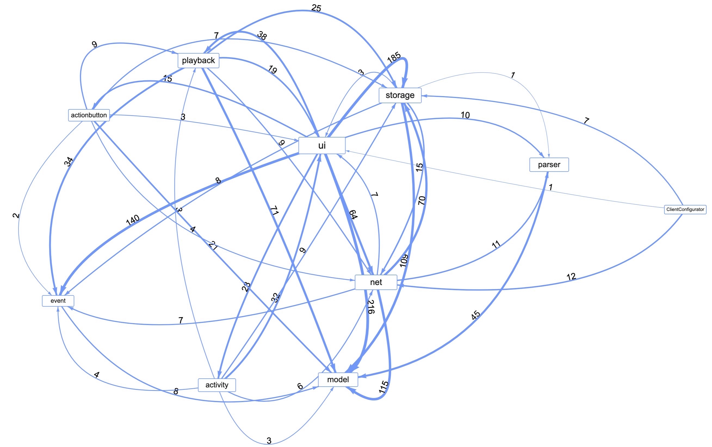
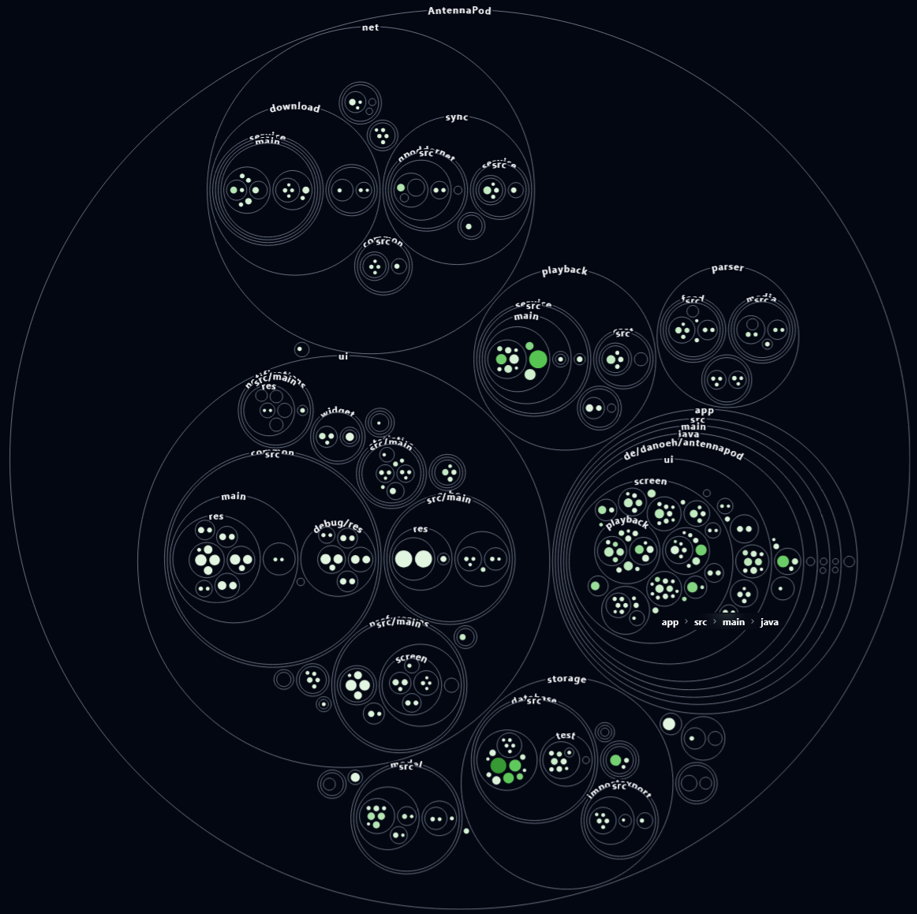
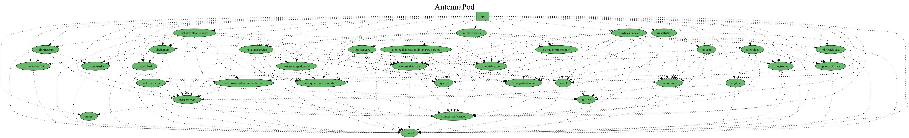

# SOARC-Architectural-Reconstruction-AntennaPod
# How to run
Make sure to have the desired java repository cloned to your machine and check that the `code_root_folder` in `arch_recovery.py` aligns with the path to where you have the repo stored on your machine.

run the program with:
`python arch_recovery.py <max_abstraction_depth>`

Try out different integer values for `max_abstraction_depth` to get a view that suits your system.

## Beware!
The getting the churn score/package_activity can take a long time to run (more than 3 minutes) depending on the size and lifetime of the project so to make testing different abstraction depths faster, commment out line 302:
`package_activity = get_package_activity(depth)`
# Cloc output

# Naive view (all files with all depndencies)

# Filtered tests, external dependencies and AST parsing

# Initial abstacted module view

# Abstacted module view with weight scaled edges and churn scaled nodes

# Prefix stripped modules and filtered weak dependencies

# Bubble diagram from gittruck (green instensity: churn, node-size: file size)

# Gradle dependency view generated with plugin
https://github.com/vanniktech/gradle-dependency-graph-generator-plugin

